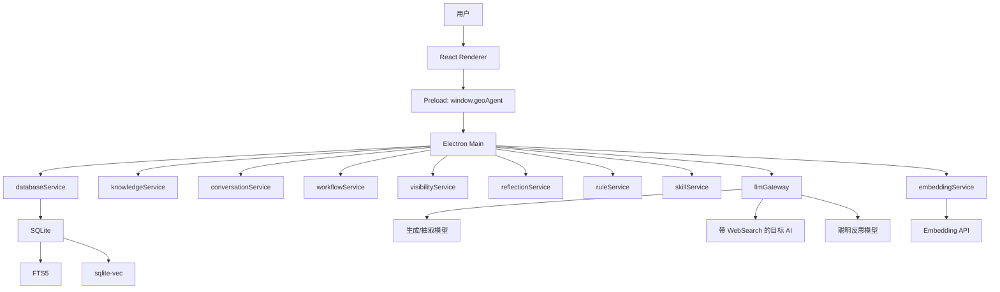

# GEO-Agent Studio 从零开发文档

> 文档版本：2026-06-01  
> 文档口径：从零开发，不兼容旧后端数据  
> 产品定位：轻量 AI 推荐可见性优化工作台  
> 推荐架构：Electron-only + React + SQLite/FTS/sqlite-vec + 火山方舟/DeepSeek/OpenAI 兼容模型  

---

## 1. 产品定位

### 1.1 一句话定位

GEO-Agent Studio 是一款轻量桌面软件，用来帮助企业提升在 AI 回答中的可见性、引用率和推荐概率。

它不是传统 SEO 工具，也不是重型 Agent 平台。它的目标不是监控网页排名，而是围绕一个更直接的问题工作：

```text
当用户向 AI 问“哪家公司好、哪家值得推荐、某地区某服务怎么选”时，AI 是否看见、理解、引用并推荐目标企业？
```

### 1.2 产品核心价值

软件帮助用户完成四件事：

1. 把企业资料整理成 AI 可理解的结构化知识库。
2. 推演真实用户会向 AI 提问的推荐类、排行榜类、采购类问题。
3. 生成更容易被 AI 理解和引用的内容资产。
4. 用目标 AI + WebSearch 检测目标企业是否被推荐，并基于结果反思优化。

### 1.3 目标用户

目标用户包括：

- GEO/SEO 服务商。
- 本地生活企业运营人员。
- ToB 企业市场人员。
- 内容营销团队。
- 希望被 AI 推荐和引用的品牌方。

## 2. 核心目标

### 2.1 GEO 的目标定义

本软件中的 GEO 指生成式引擎优化，目标是让目标企业在 AI 回答中获得更高推荐可见性。

核心指标：

| 指标 | 含义 |
|---|---|
| 是否出现 | AI 回答中是否提到目标企业 |
| 推荐排名 | 目标企业在推荐名单中的位置 |
| 推荐理由 | AI 为什么推荐目标企业 |
| 引用来源 | AI 是否引用或参考了目标企业相关内容 |
| 竞品对比 | 同一回答中出现了哪些竞品 |
| 内容缺口 | 未上榜或排名低的原因 |

### 2.2 软件要解决的问题

用户当前通常面临这些问题：

- 企业资料散落在官网、PDF、宣传册、案例文档中。
- AI 不知道企业真实优势。
- AI 回答推荐类问题时更容易推荐竞品。
- 企业不知道用户会向 AI 问哪些问题。
- 企业不知道自己有没有被 AI 推荐。
- 企业不知道应该补充什么内容才能提高推荐概率。

### 2.3 最小闭环

第一版应围绕这个闭环开发：

```text
企业资料 -> 本地知识库 -> AI 问题池 -> 高权重信源发现 -> 支撑内容 -> AI 推荐可见性检测 -> 反思优化建议
```

---

## 3. 用户流程

### 3.1 新用户首次使用

1. 用户打开软件。
2. 点击“上传资料创建知识库”。
3. 上传 PDF、DOCX、Markdown、TXT，或粘贴官网/企业资料。
4. 系统解析资料。
5. AI 抽取企业事实。
6. 用户逐项确认企业字段。
7. 系统写入本地知识库并建立检索索引。
8. 用户进入智能助手或 GEO 工作流。

### 3.2 GEO 优化流程

1. 用户选择目标企业。
2. 系统基于知识库生成 AI 问题池。
3. 用户确认问题池。
4. 系统发现高权重信源，整理发布渠道优先级。
5. 系统基于问题池和信源优先级生成支撑内容策略。
6. 系统生成咨询类、测评类、推荐理由类内容资产。
7. 用户确认内容资产。
8. 系统用目标 AI + WebSearch 检测目标企业是否被推荐。
9. 系统保存 AI 回答和检测结果。
10. 反思模型分析成功/失败原因。
11. 系统生成优化规则建议。
12. 用户确认后规则进入规则库。
12. 下一轮生成自动引用已确认规则。

### 3.3 用户体验原则

- 用户不需要理解复杂 Agent 流程。
- 每一步都能看到输入、输出和来源。
- AI 抽取结果必须可编辑。
- AI 生成内容必须可确认。
- AI 推荐检测必须保存完整回答。
- 反思建议必须由用户确认后才生效。

---

## 4. 第一版功能边界

### 4.1 第一版必须完成

| 模块 | 是否必须 | 说明 |
|---|---|---|
| 企业知识库创建 | 是 | 上传/粘贴资料，AI 抽取，用户确认，入库 |
| 本地 RAG | 是 | FTS 关键词检索，sqlite-vec 语义检索可选增强 |
| 智能助手 | 是 | 基于当前企业知识库聊天 |
| 聊天历史 | 是 | 按企业隔离，只保存真实聊天 |
| AI 问题池 | 是 | 生成推荐类、排行榜类、比较类、采购类问题 |
| 支撑内容生成 | 是 | 生成咨询类、测评类、推荐理由类内容 |
| AI 推荐可见性检测 | 建议做 | 用目标 AI + WebSearch 检测是否被推荐 |
| 反思优化建议 | 建议做 | 用聪明模型生成规则建议，用户确认后生效 |

### 4.2 第一版可以延后

- 批量检测。
- 定时检测。
- 多账号模型配置。
- 内容发布管理。
- 团队协作。
- 云同步。
- 多设备同步。

### 4.3 不做传统收录检测

本软件不把“网页是否被搜索引擎收录”作为第一目标。

更准确的目标是：

```text
AI 推荐可见性检测
```

即：目标 AI 在回答目标问题时是否推荐目标企业。

---

## 5. 推荐技术栈

### 5.1 桌面和前端

| 技术 | 用途 |
|---|---|
| Electron | 桌面应用壳 |
| React | UI |
| TypeScript | 类型系统 |
| Vite | 开发和构建 |
| Tailwind CSS | 样式 |
| Radix UI | 基础交互组件 |
| ai-elements | Chat、Message、Queue、Confirmation、Sources |

### 5.2 本地服务层

| 技术 | 用途 |
|---|---|
| Electron Main | 本地后端 |
| Preload | 暴露 `window.geoAgent` |
| SQLite | 本地数据 |
| FTS5 | 关键词检索 |
| sqlite-vec | 本地向量检索 |
| pdf-parse | PDF 解析 |
| mammoth | DOCX 解析 |

### 5.3 模型服务

| 模型类型 | 用途 |
|---|---|
| 抽取模型 | 企业资料事实抽取 |
| 生成模型 | 问题池和内容资产生成 |
| Embedding 模型 | 文档 chunk 向量化 |
| 验证模型 | AI 推荐检测结果结构化 |
| 反思模型 | 成功/失败样本分析和优化建议 |

### 5.4 模型配置建议

取消“调度模型”概念。

改为任务模型配置：

```env
# 通用生成模型
GENERATION_API_KEY=
GENERATION_BASE_URL=
GENERATION_MODEL=

# 抽取模型
EXTRACTION_API_KEY=
EXTRACTION_BASE_URL=
EXTRACTION_MODEL=

# 火山方舟 Embedding API，用于知识库 chunk 向量化
ARK_API_KEY=
ARK_EMBEDDING_BASE_URL=https://ark.cn-beijing.volces.com/api/v3
ARK_EMBEDDING_MODEL=doubao-embedding-vision-251215
ARK_EMBEDDING_DIMENSIONS=1024
ARK_EMBEDDING_CONCURRENCY=2
ARK_EMBEDDING_MAX_RETRIES=2

# AI 推荐检测模型
VISIBILITY_API_KEY=
VISIBILITY_BASE_URL=
VISIBILITY_MODEL=

# 反思模型，可配置更聪明模型
REFLECTION_API_KEY=
REFLECTION_BASE_URL=
REFLECTION_MODEL=
```

反思模型可以使用 GPT-5.4 或同等级聪明模型，但它不是主流程依赖，只在反思优化阶段调用。

火山方舟 Embedding API 只负责把本地知识库 chunk 转成向量；企业资料、切片文本、向量和检索索引全部保存在本机 SQLite/sqlite-vec 中，不上传到豆包云端知识库，也不创建云端知识库资源。

---

## 6. 总体架构

### 6.1 架构原则

```text
React 负责界面，Electron Main 负责本地后端，SQLite 负责数据，workflow events 负责流程恢复，普通聊天历史只保存真实用户对话。
```

### 6.2 架构图



### 6.3 服务职责

| 服务 | 职责 |
|---|---|
| `databaseService` | SQLite 初始化、schema、事务、FTS、sqlite-vec |
| `knowledgeService` | 知识库草稿、事实抽取、字段确认、入库、检索 |
| `conversationService` | 普通聊天、历史、企业隔离 |
| `workflowService` | GEO 流程状态、阶段产物、workflow events |
| `visibilityService` | AI 推荐可见性检测 |
| `reflectionService` | 成功/失败样本反思分析 |
| `ruleService` | 规则建议、规则确认、规则读取 |
| `skillService` | 中文 `SKILL.md` 读取和 prompt 规范 |
| `llmGateway` | 统一 LLM、WebSearch、JSON、流式调用 |
| `embeddingService` | Embedding 队列、重试、向量写入 |

---

## 7. 数据模型

### 7.1 数据隔离原则

所有企业相关数据必须绑定 `project_id`。

必须隔离的数据包括：

- 企业知识库。
- 知识 chunks。
- 向量。
- 聊天历史。
- 问题池。
- 内容草稿。
- AI 推荐检测结果。
- 反思报告。
- 进化规则。

### 7.2 核心表

#### projects

企业项目。

```sql
CREATE TABLE projects (
  id TEXT PRIMARY KEY,
  name TEXT NOT NULL,
  description TEXT,
  created_at TEXT NOT NULL,
  updated_at TEXT NOT NULL
);
```

#### enterprise_profiles

用户确认后的企业结构化资料。

```sql
CREATE TABLE enterprise_profiles (
  project_id TEXT PRIMARY KEY REFERENCES projects(id) ON DELETE CASCADE,
  profile_json TEXT NOT NULL,
  source_draft_id TEXT,
  created_at TEXT NOT NULL,
  updated_at TEXT NOT NULL
);
```

#### knowledge_drafts

知识库草稿。

```sql
CREATE TABLE knowledge_drafts (
  id TEXT PRIMARY KEY,
  project_id TEXT,
  status TEXT NOT NULL,
  input_text TEXT,
  facts_json TEXT,
  field_reviews_json TEXT,
  profile_json TEXT,
  source_quotes_json TEXT,
  warnings_json TEXT,
  created_at TEXT NOT NULL,
  updated_at TEXT NOT NULL
);
```

#### knowledge_entries

正式知识条目。

```sql
CREATE TABLE knowledge_entries (
  id TEXT PRIMARY KEY,
  project_id TEXT NOT NULL REFERENCES projects(id) ON DELETE CASCADE,
  type TEXT NOT NULL,
  title TEXT NOT NULL,
  content TEXT NOT NULL,
  metadata_json TEXT,
  created_at TEXT NOT NULL,
  updated_at TEXT NOT NULL
);
```

#### knowledge_chunks

知识切片。

```sql
CREATE TABLE knowledge_chunks (
  id TEXT PRIMARY KEY,
  project_id TEXT NOT NULL REFERENCES projects(id) ON DELETE CASCADE,
  entry_id TEXT REFERENCES knowledge_entries(id) ON DELETE CASCADE,
  title TEXT,
  content TEXT NOT NULL,
  content_hash TEXT NOT NULL,
  metadata_json TEXT,
  created_at TEXT NOT NULL
);
```

#### conversations

普通聊天会话。

```sql
CREATE TABLE conversations (
  id TEXT PRIMARY KEY,
  project_id TEXT NOT NULL REFERENCES projects(id) ON DELETE CASCADE,
  kind TEXT NOT NULL DEFAULT 'chat',
  title TEXT NOT NULL,
  created_at TEXT NOT NULL,
  updated_at TEXT NOT NULL
);
```

#### messages

普通聊天消息。

```sql
CREATE TABLE messages (
  id TEXT PRIMARY KEY,
  conversation_id TEXT NOT NULL REFERENCES conversations(id) ON DELETE CASCADE,
  project_id TEXT NOT NULL REFERENCES projects(id) ON DELETE CASCADE,
  role TEXT NOT NULL,
  content TEXT NOT NULL,
  metadata_json TEXT,
  created_at TEXT NOT NULL
);
```

#### workflow_events

流程事件。

```sql
CREATE TABLE workflow_events (
  id TEXT PRIMARY KEY,
  project_id TEXT NOT NULL REFERENCES projects(id) ON DELETE CASCADE,
  stage_key TEXT NOT NULL,
  event_type TEXT NOT NULL,
  status TEXT NOT NULL,
  title TEXT NOT NULL,
  content TEXT,
  artifact_type TEXT,
  artifact_id TEXT,
  metadata_json TEXT,
  created_at TEXT NOT NULL,
  updated_at TEXT NOT NULL
);
```

#### geo_question_sets

AI 问题池。

```sql
CREATE TABLE geo_question_sets (
  id TEXT PRIMARY KEY,
  project_id TEXT NOT NULL REFERENCES projects(id) ON DELETE CASCADE,
  platform TEXT NOT NULL,
  questions_json TEXT NOT NULL,
  status TEXT NOT NULL,
  created_at TEXT NOT NULL,
  updated_at TEXT NOT NULL
);
```

#### geo_article_drafts

支撑内容草稿。

```sql
CREATE TABLE geo_article_drafts (
  id TEXT PRIMARY KEY,
  project_id TEXT NOT NULL REFERENCES projects(id) ON DELETE CASCADE,
  question_set_id TEXT,
  article_type TEXT NOT NULL,
  title TEXT NOT NULL,
  content TEXT NOT NULL,
  citations_json TEXT,
  status TEXT NOT NULL,
  created_at TEXT NOT NULL,
  updated_at TEXT NOT NULL
);
```

#### geo_source_discoveries

高权重信源发现结果。它不代表已发稿，也不代表爬虫采集结果，而是根据问题池、企业资料和目标 AI WebSearch 观察生成的“发布渠道优先级”。

```sql
CREATE TABLE geo_source_discoveries (
  id TEXT PRIMARY KEY,
  project_id TEXT NOT NULL REFERENCES projects(id) ON DELETE CASCADE,
  question_set_id TEXT REFERENCES geo_question_sets(id) ON DELETE SET NULL,
  platform TEXT NOT NULL,
  status TEXT NOT NULL,
  source_name TEXT,
  source_url TEXT,
  source_type TEXT,
  content_format TEXT,
  priority_score REAL NOT NULL DEFAULT 0,
  reason TEXT,
  observed_in_answers TEXT,
  recommended_topics TEXT,
  discovery_json TEXT NOT NULL,
  confirmed_at TEXT,
  created_at TEXT NOT NULL,
  updated_at TEXT NOT NULL
);
```

#### ai_visibility_checks

AI 推荐可见性检测结果。

```sql
CREATE TABLE ai_visibility_checks (
  id TEXT PRIMARY KEY,
  project_id TEXT NOT NULL REFERENCES projects(id) ON DELETE CASCADE,
  question_id TEXT,
  platform TEXT NOT NULL,
  query TEXT NOT NULL,
  answer_text TEXT NOT NULL,
  target_mentioned INTEGER NOT NULL DEFAULT 0,
  target_rank INTEGER,
  target_context TEXT,
  competitors_json TEXT,
  cited_sources_json TEXT,
  analysis_json TEXT,
  checked_at TEXT NOT NULL,
  created_at TEXT NOT NULL
);
```

#### evolution_rules

用户确认后的优化规则。

```sql
CREATE TABLE evolution_rules (
  id TEXT PRIMARY KEY,
  project_id TEXT NOT NULL REFERENCES projects(id) ON DELETE CASCADE,
  platform TEXT,
  rule_type TEXT NOT NULL,
  content TEXT NOT NULL,
  evidence_count INTEGER NOT NULL DEFAULT 0,
  confidence REAL NOT NULL DEFAULT 0,
  status TEXT NOT NULL,
  created_at TEXT NOT NULL,
  updated_at TEXT NOT NULL
);
```

---

## 8. 企业知识库创建

### 8.1 四步工作台

企业知识库采用四步工作台：

```text
资料导入 -> AI 事实抽取 -> 字段核对确认 -> 入库与索引
```

### 8.2 资料导入

支持：

- PDF。
- DOCX。
- Markdown。
- TXT。
- 粘贴官网内容。
- 粘贴产品、案例、资质、服务区域、关键词资料。

要求：

- 文件解析结果可见。
- 解析失败原因可见。
- 附件内容和用户指令分开保存。
- 不把“帮我创建知识库”当作企业事实。

### 8.3 AI 事实抽取

事实结构：

```ts
type KnowledgeFact = {
  id: string;
  field: string;
  value: string;
  source_quote: string;
  source_filename?: string;
  confidence: number;
  warning?: string;
};
```

规则：

- 每条事实必须有来源片段。
- 不编造案例、资质、客户名称。
- 不把文件名当公司名。
- 不确定信息标记低置信度。

### 8.4 字段核对确认

关键字段：

- 公司名称。
- 品牌名称。
- 行业。
- 主营业务。
- 产品服务。
- 用户痛点。
- 核心优势。
- 信任背书。
- 客户案例。
- 服务区域。
- 目标关键词。
- 联系方式。

用户确认前不写正式企业知识库。

### 8.5 入库与索引

确认后执行：

1. 写入 `projects`。
2. 写入 `enterprise_profiles`。
3. 写入 `knowledge_entries`。
4. 切分 `knowledge_chunks`。
5. 写入 FTS5。
6. 按 chunk 的 `content_hash` 创建缺失的 Embedding jobs。
7. `embeddingService` 使用 `ARK_API_KEY` 调用火山方舟 Embedding API。
8. 将返回向量写入 sqlite-vec。
9. 更新 workflow event 和知识库索引状态。

火山方舟 Embedding 处理规则：

- 默认接口地址为 `ARK_EMBEDDING_BASE_URL=https://ark.cn-beijing.volces.com/api/v3`。
- 默认模型由 `ARK_EMBEDDING_MODEL` 配置，第一版建议使用 `doubao-embedding-vision-251215`。
- 默认维度由 `ARK_EMBEDDING_DIMENSIONS` 配置，必须和 sqlite-vec 表维度一致。
- 默认并发由 `ARK_EMBEDDING_CONCURRENCY` 控制，建议第一版设为 `2`，避免触发限流。
- 失败后按 `ARK_EMBEDDING_MAX_RETRIES` 重试，仍失败则标记 job 为 `failed`。
- 无 `ARK_API_KEY`、接口失败或向量未完成时，FTS 仍可用，软件不阻断知识库创建。
- `reindexKnowledge(projectId)` 只补齐缺失或内容 hash 变化的向量，不重复向量化相同 chunk，避免重复计费。

---

## 9. AI 问题池

### 9.1 问题池目标

问题池不是营销任务列表，而是真实用户可能向 AI 提问的问题。

问题类型：

- 推荐类：`成都汽车音响改装哪家好？`
- 排行榜类：`成都汽车音响改装店排行榜`
- 比较类：`A 品牌和 B 品牌怎么选？`
- 采购类：`成都预制菜供应商推荐`
- 避坑类：`选择汽车隔音店要注意什么？`
- 区域类：`西南地区速冻食品厂家哪家靠谱？`

### 9.2 生成输入

- 企业知识库。
- 目标关键词。
- 服务区域。
- 产品服务。
- 用户痛点。
- 已确认 evolution rules。

### 9.3 输出结构

```ts
type GeoQuestion = {
  id: string;
  question: string;
  intent: 'recommendation' | 'ranking' | 'comparison' | 'purchase' | 'avoidance' | 'regional';
  priority: number;
  reason: string;
  related_keywords: string[];
};
```

### 9.4 质量要求

- 问题必须像真实用户会问的。
- 问题必须和企业业务相关。
- 问题不能是“帮我写营销文案”。
- 问题应服务后续 AI 推荐检测。

---

## 10. 支撑内容生成

## 10. 高权重信源发现

### 10.1 信源发现目标

高权重信源发现用于回答：目标 AI 更容易引用哪些公开平台、网站、文章类型和证据结构。

它不是发稿系统，也不是传统爬虫；它只为后续内容生成和发布渠道选择提供优先级。

### 10.2 触发条件

AI 问题池生成并确认后触发。

### 10.3 输入

- 企业资料。
- AI 问题池。
- 目标平台，例如 ChatGPT、豆包、DeepSeek、Kimi、Perplexity。
- 目标行业、业务类型、用户场景。

### 10.4 动作

1. 询问目标 AI：当前行业和问题类型中，它更倾向引用哪些站点、平台或内容形态。
2. 用问题池中的高优先级问题进行真实 WebSearch 提问或搜索观察。
3. 记录 AI 回答中出现的引用来源、竞品来源、文章类型和证据线索。
4. 合并生成发布渠道优先级。

### 10.5 输出

```ts
type GeoSourceDiscovery = {
  id: string;
  project_id: string;
  question_set_id?: string | null;
  platform: string;
  channel_priorities: Array<{
    source_name: string;
    source_url?: string | null;
    source_type: string;
    content_format: string;
    priority_score: number;
    reason: string;
    observed_in_answers: string;
    recommended_topics: string[];
  }>;
  content_distribution_strategy: {
    primary_channels: string[];
    content_formats: string[];
    citation_structure: string;
    next_step: string;
  };
};
```

### 10.6 质量要求

- 不编造“已引用”事实。
- 没有真实 URL 时可以留空，但必须说明判断依据。
- 输出必须服务后续咨询类、测评类、排行榜类内容生成。
- 第一版只输出发布渠道优先级，不做自动发稿。

---

## 11. 支撑内容生成

### 10.1 内容目标

支撑内容不是泛泛营销文章，而是为 AI 推荐提供可引用事实和推荐理由。

内容应帮助 AI 回答：

- 这家公司是谁？
- 为什么值得推荐？
- 适合什么用户？
- 解决什么问题？
- 有什么案例或背书？
- 与竞品有什么差异？

### 10.2 第一版内容类型

| 类型 | 目标 |
|---|---|
| 咨询类文章 | 回答用户怎么选、注意什么、怎么判断 |
| 测评类文章 | 对比方案、列出标准、自然引出目标企业优势 |
| 推荐理由卡 | 用结构化方式总结企业为何值得推荐 |

### 10.3 内容生成输入

- 企业 profile。
- RAG top chunks。
- AI 问题池。
- 已确认高权重信源发现结果。
- 已确认 evolution rules。

### 10.4 内容质量要求

- 必须引用企业知识库事实。
- 不得编造案例和资质。
- 标题贴近问题池。
- 内容结构清晰，适合 AI 摘取。
- 每篇内容输出引用依据。

---

## 12. AI 推荐可见性检测

### 11.1 为什么不用爬虫

传统爬虫复杂、不稳定、维护成本高，而且不一定能反映 GEO 的真实目标。

GEO 更关心的是：

```text
AI 回答用户问题时有没有推荐目标企业。
```

因此验证方式采用：

```text
目标 AI + WebSearch 提问检测
```

### 11.2 检测流程

1. 从问题池选择问题。
2. 调用目标 AI 的 WebSearch 能力。
3. 要求 AI 联网回答推荐名单和理由。
4. 保存完整回答。
5. 结构化解析回答。
6. 判断目标企业是否出现。
7. 记录排名、推荐理由、竞品和引用来源。

### 11.3 检测 prompt 示例

```text
请联网搜索并回答：{question}

要求：
1. 给出你会推荐的企业或品牌名单。
2. 说明每个推荐对象的理由。
3. 如果有来源，请列出来源标题和链接。
4. 不要为了迎合用户强行推荐某个企业。
```

### 11.4 检测结果结构

```ts
type AiVisibilityCheck = {
  id: string;
  project_id: string;
  question: string;
  platform: 'doubao' | 'deepseek' | 'kimi' | 'yuanbao' | 'chatgpt' | string;
  answer_text: string;
  target_company_mentioned: boolean;
  target_company_rank: number | null;
  target_company_context: string | null;
  competitors: Array<{
    name: string;
    rank: number | null;
    reason: string;
  }>;
  cited_sources: Array<{
    title: string;
    url?: string;
    snippet?: string;
  }>;
  checked_at: string;
};
```

### 11.5 UI 展示

推荐可见性页面展示：

- 检测问题。
- 检测平台。
- 是否上榜。
- 上榜位置。
- AI 推荐理由。
- 竞品列表。
- 引用来源。
- 完整回答。
- 历史趋势。

---

## 12. 反思优化系统

### 12.1 设计原则

自动进化不是黑箱自动改规则。

正确流程：

```text
采集证据 -> 对比样本 -> 聪明模型反思 -> 生成建议 -> 用户确认 -> 更新规则库
```

### 12.2 输入数据

反思系统输入：

- 企业 profile。
- 问题池。
- 支撑内容。
- AI 推荐检测结果。
- 竞品名单。
- 引用来源。
- 已确认规则。

### 12.3 反思分析内容

聪明模型分析：

- 成功上榜的问题有什么共同点。
- 未上榜的问题缺少什么证据。
- 竞品为什么被推荐。
- 目标企业的推荐理由是否清晰。
- 哪些企业字段需要补充。
- 哪些内容结构更容易被引用。
- 下一轮内容应该强化什么。

### 12.4 规则建议结构

```ts
type EvolutionRuleSuggestion = {
  id: string;
  project_id: string;
  platform?: string;
  rule_type: 'title' | 'structure' | 'evidence' | 'keyword' | 'source' | 'avoid';
  content: string;
  reason: string;
  evidence_count: number;
  confidence: number;
  status: 'suggested' | 'approved' | 'rejected';
};
```

### 12.5 用户确认

系统只能生成建议。

只有用户点击确认后：

- 规则写入 `evolution_rules`。
- 下一轮问题池生成可读取规则。
- 下一轮内容生成可读取规则。
- 下一轮推荐检测可读取规则。

---

## 13. Skills / Prompt 规范

### 13.1 Skills 定位

Skills 是中文 prompt 规范，不是脚本执行系统。

用途：

- 约束模型输出。
- 固定结构化格式。
- 统一质量要求。
- 避免 prompt 散落在代码里。

### 13.2 用户可见技能

第一版智能助手只显示：

```text
企业知识库创建
```

对应 skill：

```text
knowledge-base-ingest
```

### 13.3 内部技能

内部 skills：

- `geo-question-set`
- `geo-source-discovery`
- `geo-support-content`
- `geo-visibility-check`
- `geo-reflection`

这些不在技能下拉中展示，由系统流程自动调用。

### 13.4 Skill 文件格式

```markdown
---
name: geo-visibility-check
description: 用于通过目标 AI + WebSearch 检测企业是否被推荐。
visibility: internal
---

# AI 推荐可见性检测

## 目标

围绕问题池向目标 AI 提问，判断目标企业是否被推荐、排名如何、竞品是谁、引用来源是什么。

## 规则

- 必须保存完整回答。
- 必须结构化目标企业是否出现。
- 必须识别竞品。
- 不要把“未出现”误判为“未收录”。

## 输出

- answer_text
- target_company_mentioned
- target_company_rank
- competitors
- cited_sources
```

---

## 14. 智能助手与聊天历史

### 14.1 智能助手职责

智能助手负责：

- 创建知识库入口。
- 基于当前企业知识库问答。
- 展示当前 GEO 工作流入口。
- 展示真实聊天历史。

### 14.2 聊天历史规则

普通聊天历史只保存真实用户聊天。

不进入聊天历史：

- 知识库草稿。
- 阶段结果。
- AI 推荐检测结果。
- 反思建议。
- 规则建议。

这些内容进入 workflow events 或专门业务表。

### 14.3 企业隔离

所有聊天必须绑定 `project_id`。

打开历史前必须校验：

- 会话存在。
- 会话属于当前企业。
- 会话类型为 `chat`。

---

## 15. UI 页面设计

### 15.1 页面列表

| 页面 | 作用 |
|---|---|
| Dashboard | 总览企业知识库、内容资产、推荐可见性 |
| KnowledgeBase | 企业知识库创建和管理 |
| AgentStudio | 智能助手和当前工作流 |
| VisibilityCheck | AI 推荐可见性检测 |
| EvolutionRules | 反思建议和规则库 |
| Drafts | 内容草稿 |

### 15.2 KnowledgeBase

核心模块：

- 上传资料创建知识库。
- AI 事实抽取。
- 字段核对确认。
- 入库与索引 Queue。
- RAG 状态。
- 知识条目列表。

### 15.3 VisibilityCheck

核心模块：

- 选择问题池。
- 选择检测平台。
- 运行 AI WebSearch 检测。
- 展示完整回答。
- 展示是否上榜和排名。
- 展示竞品和来源。

### 15.4 EvolutionRules

核心模块：

- 成功/失败样本对比。
- 反思报告。
- 规则建议列表。
- 确认/拒绝规则。
- 已确认规则库。

---

## 16. API / IPC 契约

Renderer 只通过 `window.geoAgent` 调用本地服务。

核心接口：

```ts
type GeoAgentApi = {
  createKnowledgeDraft(payload: CreateKnowledgeDraftPayload): Promise<GeoAgentKnowledgeDraft>;
  confirmKnowledgeDraft(draftId: string, profileOverride: EnterpriseProfile): Promise<ConfirmKnowledgeDraftResult>;
  searchKnowledge(projectId: string, query: string, limit?: number): Promise<KnowledgeSearchResult[]>;

  sendChat(payload: SendChatPayload): Promise<ChatResponse>;
  sendChatStream(payload: SendChatPayload, onEvent: (event: ChatStreamEvent) => void): Promise<ChatStreamDoneEvent>;
  getConversations(projectId: string, limit?: number): Promise<ConversationSummary[]>;
  getConversation(conversationId: string, projectId: string): Promise<ConversationWithMessages>;

  generateQuestionSet(projectId: string, platform: string): Promise<GeoQuestionSet>;
  generateSourceDiscovery(projectId: string, questionSetId: string, platform: string): Promise<GeoSourceDiscovery>;
  getSourceDiscoveries(projectId: string, platform?: string): Promise<GeoSourceDiscovery[]>;
  confirmSourceDiscovery(discoveryId: string): Promise<GeoSourceDiscovery>;
  generateSupportContent(projectId: string, questionSetId: string): Promise<GeoArticleDraft[]>;

  runAiVisibilityCheck(projectId: string, questionIds: string[], platform: string): Promise<AiVisibilityCheckBatch>;
  generateReflection(projectId: string, checkBatchId: string): Promise<ReflectionReport>;
  approveEvolutionRule(ruleId: string): Promise<EvolutionRule>;
  rejectEvolutionRule(ruleId: string): Promise<EvolutionRule>;
};
```

---

## 17. 开发步骤

### 17.1 第 1 步：Electron 壳和 Preload

- 创建 React + Vite + Electron 项目。
- 建立 `window.geoAgent`。
- 跑通桌面窗口。

### 17.2 第 2 步：SQLite 本地数据层

- 初始化 SQLite。
- 建立 schema。
- 实现事务。
- 初始化 FTS。

### 17.3 第 3 步：企业知识库

- 文档解析。
- AI 事实抽取。
- 字段确认。
- 入库。
- FTS 检索。
- sqlite-vec 增强。

### 17.4 第 4 步：智能助手和历史

- 普通聊天。
- 当前企业 RAG。
- 聊天历史。
- 企业隔离。

### 17.5 第 5 步：AI 问题池

- 从知识库生成问题。
- 保存 question set。
- 支持用户确认。

### 17.6 第 6 步：高权重信源发现

- 基于问题池和企业资料询问目标 AI 偏好的引用来源。
- 用高优先级问题进行 AI WebSearch 观察。
- 保存 source discovery 和发布渠道优先级。
- 支持用户确认后供内容生成读取。

### 17.7 第 7 步：支撑内容生成

- 生成咨询类内容。
- 生成测评类内容。
- 生成推荐理由卡。
- 内容生成必须读取已确认信源发现结果。

### 17.8 第 8 步：AI 推荐可见性检测

- 调用目标 AI + WebSearch。
- 保存完整回答。
- 结构化检测结果。
- 展示上榜、排名、竞品、来源。

### 17.8 第 8 步：反思优化

- 汇总成功/失败样本。
- 调用反思模型。
- 生成规则建议。
- 用户确认规则。
- 下一轮生成读取规则。

---

## 18. 测试与验收

### 18.1 知识库验收

- 上传资料后 AI 抽取结果有来源片段。
- 用户确认前不创建正式知识库。
- 无 Embedding API Key 时 FTS 可用。
- 有 Embedding API Key 时 sqlite-vec 可用。

### 18.2 企业隔离验收

- 企业 A 和企业 B 的知识库不能串库。
- 企业 A 和企业 B 的聊天不能串库。
- 企业 A 和企业 B 的检测结果不能串库。
- 企业 A 和企业 B 的规则不能串库。

### 18.3 内容验收

- 问题池必须像真实用户会问的问题。
- 支撑内容必须引用企业知识库事实。
- 不得编造案例、资质、客户名称。

### 18.4 推荐检测验收

- 检测必须保存完整 AI 回答。
- 检测必须输出目标企业是否出现。
- 检测必须输出排名、推荐理由、竞品、来源。
- 未出现不能简单写成“未收录”，应写“本次检测未被推荐”。

### 18.5 反思优化验收

- 反思只能生成建议。
- 不能自动覆盖规则。
- 用户确认后规则才生效。
- 下一轮生成能读取已确认规则。

### 18.6 构建验收

```powershell
npm run lint
npm run build:web
npm run dist
```

必须全部通过。

---

## 19. 最终原则

```text
先让 AI 看懂企业，再让 AI 有内容可引用，然后用 AI 自己的 WebSearch 回答来验证是否被推荐，最后基于证据反思下一轮怎么优化。
```
