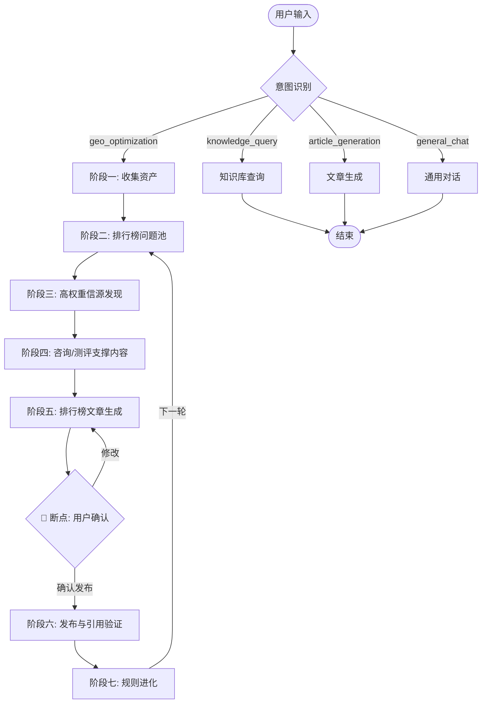
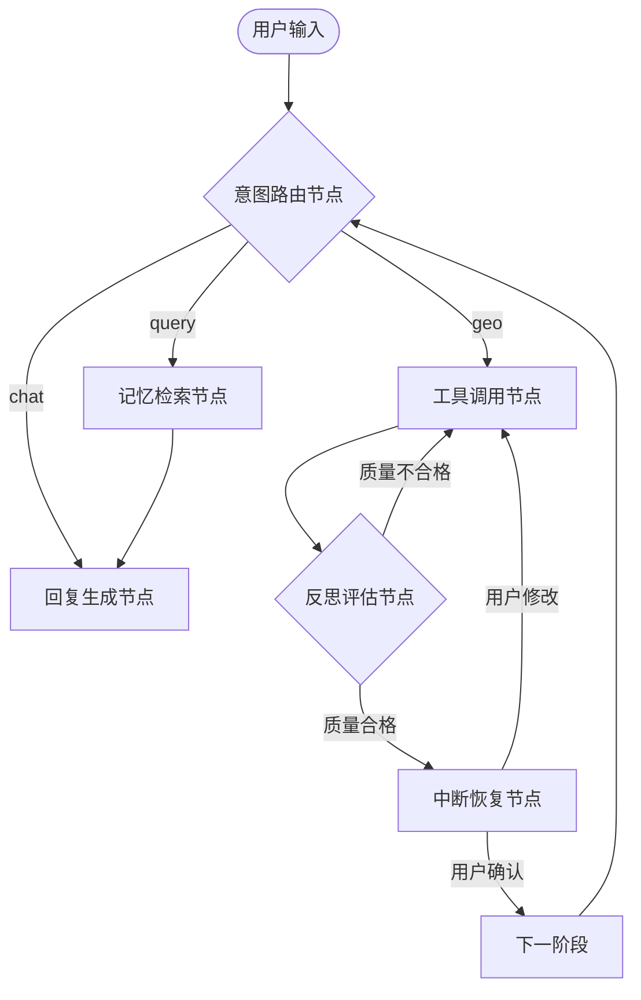

# GEO-Agent Studio 完整开发文档

---

## 第一章：产品概述

### 1.1 产品定位

一款面向 Windows 本地桌面环境，基于 LangGraph 状态机驱动，围绕"让目标 AI 引用我方内容，并在排行榜/推荐类回答中推荐目标企业"构建的企业级 GEO（生成式引擎优化）生产力工作站。

用户提供企业资料、附件和目标关键词后，系统驱动完整的 7 阶段 GEO 优化流水线——从企业事实知识库、排行榜问题池、高权重信源发现，到咨询/测评支撑内容、排行榜文章、发布验证和规则进化。涉及入库、发稿、规则更新等高影响动作时，采用确认式自动化，由用户确认后继续执行。

### 1.2 "脑-手-眼"协同架构

```
┌─────────────────────────────────────────────────────────────┐
│                      GEO-Agent Studio                       │
│                                                             │
│   ┌─────────────┐    ┌─────────────┐    ┌─────────────┐    │
│   │  🧠 大脑     │    │  🤲 双手     │    │  👁 视窗     │    │
│   │  (Brain)     │───▶│  (Hands)    │◀───│  (Eye)      │    │
│   │              │    │             │    │             │    │
│   │ 可配置调度模型 │    │ .skills/    │    │ Electron    │    │
│   │ 当前 GPT-5.4  │    │ Python 脚本 │    │ + React     │    │
│   │ 豆包模型      │    │ Node.js     │    │ Chat UI     │    │
│   │ DeepSeek 模型 │    │ 爬虫/API    │    │ 动态面板     │    │
│   └─────────────┘    └─────────────┘    └─────────────┘    │
│         │                   │                   │           │
│         ▼                   ▼                   ▼           │
│   ┌─────────────────────────────────────────────────────┐   │
│   │              LangGraph 状态机                        │   │
│   │     路由 → 阶段1 → 阶段2 → ... → 阶段7 → 进化循环    │   │
│   └─────────────────────────────────────────────────────┘   │
└─────────────────────────────────────────────────────────────┘
```

- **大脑 (Brain)**：调度层。可配置调度模型负责意图识别、流程编排、结构化抽取和反思总结；当前默认使用 GPT-5.4。执行层使用豆包模型（豆包平台优化时）和 DeepSeek 模型（DeepSeek 平台优化时）生成内容。
- **双手 (Hands)**：存放在 `.skills/` 中的独立 Python 脚本。包括知识库解析、文章生成、爬虫轮询、媒介盒子 API 发稿等。
- **视窗 (Eye)**：Electron + React 构建。以 Chat 输入框为枢纽，右侧配合动态展示面板（知识库卡片 / 富文本编辑器 / 发稿控制台 / 数据看板）。

---

## 第二章：GEO 确认式优化流程

本章描述软件的核心业务逻辑。整个 GEO 优化分为 7 个阶段，严格按序执行，每个阶段的输出是下一阶段的输入。

### 2.0 企业知识库与 GEO 项目状态边界

为避免后续阶段产物污染企业事实资料，系统将数据拆成两层：

| 层级 | 保存内容 | 不保存内容 |
|------|----------|------------|
| 企业知识库 | 公司资料、产品服务、用户痛点、信任背书、案例、业务区域、目标关键词、附件解析出的事实 chunk、RAG 索引状态 | 排行榜问题池、信源发现结果、发稿策略、文章草稿、引用验证、进化规则 |
| GEO 项目状态 | 一次企业 GEO 优化任务的 7 阶段状态、当前阶段、目标平台、阶段一预设关键词、后续问题池/信源/文章/验证产物引用 | 原始企业资料全文、附件原文、可检索事实 chunk |

阶段一的企业知识库是事实资产层；阶段二到阶段七的结果应写入独立项目状态或专门报告表，不写入 `knowledge_entries`。多企业场景必须通过 `project_id` 隔离资料、附件、向量索引和 GEO 项目状态。

知识库建立采用草稿确认式入库：上传资料或在 ChatBox 中触发知识库录入技能后，调度模型先按模板生成结构化草稿，用户确认后才正式写入 SQLite、生成知识条目并建立 LanceDB 索引。

### 2.1 阶段一：客户资产获取与基础信息初始化

**核心目标**：收集原始物料，并将客户非专业的诉求转化为大模型可理解的基础参数。

#### 收集原始图文资料

| 资料类型 | 具体内容 |
|----------|----------|
| 基础文本 | 公司全称/简称、客服电话、区域范围 |
| 深度文本 | 企业详介（≥1000字）、产品特点、用户痛点、大客户案例、专家团队（构建 EEAT 雏形） |
| 视觉资产 | 门头照、全景图（**必须与高德/美团等地图平台保持一致**，确立全网数据唯一性标识） |
| 推广关键词 | 客户提供的原始关键词（通常宽泛不准确，如只给"汽车音响"） |

#### 第一次关键词演进

> **背景**：绝大多数客户缺乏 SEO/GEO 专业知识，提供的关键词往往极其宽泛或不准确。

**操作**：将客户提供的"草根词"，套用标准公式重塑为预设关键词：

```
预设关键词 = [地区范围] + [行业规范统称] + [主体]

示例：
"汽车音响" → "成都" + "汽车音响改装" + "行乐音改"
```

这些经过初步规范的词，将作为打开下一步"AI 探测雷达"的初始口令。

**输出**：企业知识库（结构化文档）+ 预设关键词列表（1-5 个）

---

### 2.2 阶段二：排行榜问题池构建

**核心目标**：拿着阶段一的预设关键词和企业事实，生成真实用户会向目标 AI 提问的排行榜/推荐类问题池。阶段二不生成营销全案，不诊断"为什么没上榜"，只确定后续内容要服务哪些搜索意图。

> **触发条件**：阶段一知识库构建完成。
>
> **输入**：预设关键词 + 企业背景信息 + 知识库摘要。
>
> **平台隔离**：用户在智能助手选择豆包模型，即推进豆包问题池；选择 DeepSeek，即推进 DeepSeek 问题池。阶段一知识库共用，阶段二以后按平台独立保存。

#### 动作一：生成用户真实问题池

围绕目标关键词、区域词、品类词和采购场景，生成用户可能真实搜索的问题。例如：

- 成都 ToB 预制菜供应商哪家好
- 成都预制菜定制厂家哪家靠谱
- 成都火锅丸滑批发去哪里
- 西南速冻食品供应商推荐

#### 动作二：筛选高优先级排行榜问题

从真实问题池中筛选最值得优先做内容的排行榜/推荐题目。筛选依据包括：

- 是否包含"排行榜、推荐、哪家好、供应商、厂家、公司、品牌"等转化词。
- 是否包含明确区域、品类或业务场景。
- 是否能自然引出目标企业的事实优势。

**输出**：平台独立问题池 `geo_question_sets`，只包含 `question_pool`、`ranking_questions`。支撑内容、信源查询、缺失事实和下一步计划不进入阶段二主结果。

---

### 2.3 阶段三：高权重信源发现

**核心目标**：找出目标 AI 更容易引用的公开平台和网站，并整理成"发布渠道优先级"。阶段三不写文章，只决定后续咨询类、测评类、排行榜类内容优先发布到哪里。

> **触发条件**：阶段二排行榜问题池生成完毕。
>
> **输入**：排行榜问题池 + 企业资料 + 初始关键词。

#### 动作一：询问目标 AI 推荐信源

向当前目标平台询问：基于该行业、业务类型和用户提问，它更倾向引用哪些站点、平台或内容形态。

#### 动作二：用真实问题观察引用来源

用阶段二的高优先级问题进行实际提问或搜索，记录 AI 回答中已经引用的站点、文章类型和证据线索。

#### 动作三：合并发布渠道优先级

将 AI 推荐信源和实测引用信源合并评分，输出：

- 优先发布渠道
- 信源类型
- 推荐原因
- 置信度/评分
- 适合发布的内容类型：咨询类、测评类、排行榜类
- 待验证证据

**输出**：平台独立信源发现结果 `geo_source_discoveries`。

---

### 2.4 阶段四：咨询/测评支撑内容生成

**核心目标**：先生成排行榜文章的底层支撑内容，让 AI 在理解企业时有足够可引用的事实依据。阶段四不生成排行榜。

> **触发条件**：阶段三高权重信源发现完成。
>
> **输入**：企业知识库事实 + 阶段二问题池 + 阶段三信源发现。

#### 咨询类/品牌建设类文章

用于回答行业问题、选择标准、避坑指南和企业可信度。它服务于排行榜排序逻辑，但不直接写排行榜。

#### 测评类/产品业务类文章

用于介绍企业产品、服务、方案、能力、案例、价格区间和履约能力。所有判断必须能追溯到企业事实或阶段三信源，缺失事实必须显式列出。

**输出**：平台独立文章草稿 `geo_article_drafts`，`article_type=consulting|review`。草稿不写入 `knowledge_entries`。

---

### 2.5 阶段五：排行榜文章生成

**核心目标**：在咨询类和测评类支撑内容完成后，再生成排行榜/推荐类文章，让排行榜内容有事实支撑链，而不是孤立软文。

> **触发条件**：同一平台的咨询类和测评类支撑文章均已生成。
>
> **输入**：阶段二排行榜问题 + 阶段三信源 + 阶段四支撑文章。

排行榜文章必须：

- 说明排序维度和事实来源。
- 引用前置咨询类、测评类支撑内容。
- 不编造竞品数据、第三方评价、案例、资质。
- 明确目标企业为什么值得进入榜单，但避免无法核验的绝对化表达。

**输出**：平台独立排行榜文章草稿 `geo_article_drafts`，`article_type=ranking`。

---

### 2.6 阶段六：发布与引用验证

**核心目标**：将咨询类、测评类和排行榜类内容发布到阶段三确定的高权重信源渠道，然后用阶段二问题重新提问，验证目标 AI 是否引用、是否推荐目标企业。

> **触发条件**：用户在 UI 上确认文章草稿（LangGraph 断点恢复）。
>
> **输入**：确认后的文章 + 阶段三发布渠道优先级 + 阶段二问题池。

#### 动作一：确认式发布

不做全自动发稿。系统推荐渠道、标题和发布顺序，用户确认后才执行发布或记录外部发布结果。

#### 动作二：引用验证

用阶段二高优先级问题重新向目标 AI 提问，记录：

- 是否引用我方文章。
- 是否推荐目标企业。
- 推荐位置。
- 引用渠道和证据片段。
- 未引用/未推荐的可能原因。

**输出**：平台独立引用验证结果 `geo_citation_checks`。

---

### 2.7 阶段七：规则进化机制

**核心目标**：根据引用验证结果，更新平台规则、信源权重、文章模板偏好和关键词优先级。

> **触发条件**：阶段六引用验证完成后，由用户触发或定时任务触发。
>
> **输入**：文章草稿、发布渠道、引用验证结果。

**核心目标**：打破固定模板的僵化，软件在后台自动学习"为什么这篇文章能上榜"，并将成功经验反写进底层规则，让系统越用越聪明。

> **触发条件**：阶段六首轮发稿完成后，由定时任务（CronJob）自动触发。
>
> **输入**：发稿记录 + 收录数据。

#### 循环节奏

```
┌──────────────┐     ┌──────────────┐     ┌──────────────┐     ┌──────────────┐
│  定时轮询     │────▶│  多维反思     │────▶│  规则重写     │────▶│  下轮生成     │
│  (The Eye)   │     │  (The Brain) │     │  (The Hands) │     │  (Evolution) │
│              │     │              │     │              │     │              │
│ 模拟提问      │     │ 4维度对比分析 │     │ 更新 rules/  │     │ 调用进化后的  │
│ 抓取收录结果  │     │ 提炼成功特征  │     │ 更新 ELO 积分 │     │ 提示词+渠道   │
└──────────────┘     └──────────────┘     └──────────────┘     └──────────────┘
        │                                                                  │
        └──────────────────────────────────────────────────────────────────┘
                              持续循环，越用越准
```

#### 步骤一：定时轮询与收录捕获（The Eye）

- 后台定时自动运行，带着阶段三敲定的"核心词/长尾词"，去豆包、DeepSeek 等目标 AI 平台模拟提问
- 自动抓取结果并比对记录：
  - 我们的品牌有没有上榜？排第几？
  - 大模型底层实际引用的是我们发布的哪篇文章？
  - 文章挂在哪个自媒体/官媒平台上？

#### 步骤二：多维反思与成功特征提取（The Brain）

当捕获到"成功收录并排名前列"的文章后，自动唤醒中央大脑（GPT-5.4 / Gemini 3.1），将其与"未收录的文章"进行全方位交叉对比分析。分析维度：

| 维度 | 分析内容 | 示例发现 |
|------|----------|----------|
| 标题维度 | 不同平台对标题风格的偏好 | 豆包偏好带数字的盘点型标题；DeepSeek 偏好技术陈述型标题 |
| 内容结构维度 | 文章结构对收录的影响 | 被收录的文章都自带 Markdown 数据表格；或采用了特定小标题排版 |
| 渠道权重维度 | 不同媒体的收录效果差异 | 当前行业中，搜狐号的权重远大于网易号 |
| 交叉验证维度 | 跨平台信息一致性 | AI 更倾向收录在多个平台有一致信息的品牌 |

#### 步骤三：规则重写与模板自动升级（The Hands）

**更新平台规则模板**：提炼出规律后，将成功经验写入目标平台的专属配置文件；高置信度规则可由用户确认后生效：

- `rules/doubao.md` — 豆包平台进化规则
- `rules/deepseek.md` — DeepSeek 平台进化规则

示例：追加一条系统指令 → "基于近期学习，豆包极易收录带有对比表格和具体价格锚点的测评文，后续生成此类文章时必须包含表格。"

**更新信源权重积分榜（ELO 系统）**：
- 成功被 AI 引用的信源渠道 → 加权重积分
- 连续发布后未被引用的渠道 → 扣除积分
- 形成渠道的末位淘汰机制

#### 步骤四：高维度的下一轮自动循环

当用户或系统发起第二轮、第三轮文章生成和发稿任务时：
- 调用的已经是经过进化的专属平台 skill 与规则
- 发布界面会优先推荐高积分信源渠道
- 随着时间推移，该系统针对某个具体行业的 GEO 把控力将达到人类优化师无法企及的精准度

---

## 第三章：系统架构

### 3.1 三层模型架构

```
┌─────────────────────────────────────────────────────────┐
│                    调度层 (Dispatch)                      │
│            GPT-5.4 / Gemini 3.1                          │
│    意图识别 │ 流程编排 │ 反思总结 │ 规则进化              │
├─────────────────────────────────────────────────────────┤
│                    执行层 (Execution)                     │
│         豆包模型          │        DeepSeek 模型          │
│    问题池生成 │ 信源发现 │ 支撑内容 │ 排行榜文章            │
├─────────────────────────────────────────────────────────┤
│                    工具层 (Tools)                         │
│    知识库解析 │ 爬虫轮询 │ 媒介盒子 API │ 图床上传        │
│    数据库读写 │ 文件操作 │ ELO 计算                      │
└─────────────────────────────────────────────────────────┘
```

- **调度层**：使用最强模型（GPT-5.4 / Gemini 3.1），负责"思考"——理解用户意图、决定执行路径、分析反思结果
- **执行层**：使用平台专属模型，负责"干活"——豆包平台用豆包模型写文章，DeepSeek 平台用 DeepSeek 模型写文章
- **工具层**：纯代码实现，负责"跑腿"——解析文档、调 API、爬数据、读写数据库

### 3.2 LangGraph 状态图



### 3.3 状态模型

```python
from pydantic import BaseModel, Field
from typing import Optional

class GeoProjectState(BaseModel):
    """GEO 优化项目状态 — 贯穿 7 个阶段"""
    project_id: Optional[str] = None
    company_name: str = ""
    industry: str = ""
    region: str = ""
    platforms: list[str] = Field(default_factory=lambda: ["doubao", "deepseek"])

    # 阶段一输出
    knowledge_base_id: Optional[str] = None
    raw_documents: list[dict] = Field(default_factory=list)
    initial_keywords: list[str] = Field(default_factory=list)  # 第一次演进结果

    # 阶段二以后按平台独立输出
    question_sets: dict[str, dict] = Field(default_factory=dict)  # platform -> 排行榜问题池
    source_discoveries: dict[str, dict] = Field(default_factory=dict)  # platform -> 高权重信源发现
    article_drafts: dict[str, dict] = Field(default_factory=dict)  # platform -> consulting/review/ranking
    eeat_cards: list[dict] = Field(default_factory=list)
    knowledge_graph: dict = Field(default_factory=dict)

    # 阶段四输出
    competitor_analysis: dict = Field(default_factory=dict)
    reference_sites: dict = Field(default_factory=dict)  # 白名单发稿阵地
    ai_priority_ranking: dict = Field(default_factory=dict)  # AI 评价优先级

    # 阶段五输出
    articles: dict[str, list[dict]] = Field(default_factory=dict)  # type -> [articles]

    # 阶段六输出
    publish_records: list[dict] = Field(default_factory=list)

    # 流程控制
    current_phase: str = "idle"
    current_platform: str = ""

class AgentState(BaseModel):
    """全局 Agent 状态"""
    message: str = ""
    conversation_id: Optional[str] = None
    intent: Optional[str] = None
    response: str = ""
    context: dict = Field(default_factory=dict)
    geo_project: Optional[GeoProjectState] = None
```

### 3.4 双通道并行机制

阶段二开始支持豆包和 DeepSeek 双通道独立执行：

- 两个平台共享同一份企业事实知识库
- 各自使用平台专属模型和流程状态
- 各自独立产出问题池、信源发现结果、文章草稿和引用验证结果
- 进化规则独立维护——豆包的发现不会污染 DeepSeek 的规则

---

## 第四章：AI 驱动交互模型

本章定义软件的用户交互范式。核心原则：**ChatBox 是唯一枢纽，AI 主导执行，人类只做确认和纠偏。**

### 4.1 ChatBox 能力定义

ChatBox 不是简单的文字输入框，而是整个软件的"万能入口"。所有 GEO 操作都通过对话完成。

#### 支持的消息类型

| 消息类型 | 说明 | 示例 |
|----------|------|------|
| 纯文本 | 普通对话 | "帮我做 GEO 优化" |
| 富卡片 | AI 返回结构化信息卡片 | 问题池卡片、信源卡片、知识库摘要卡片 |
| 表格 | AI 返回对比数据 | 竞品分析表、关键词排名表 |
| 图表 | AI 生成可视化数据 | 收录趋势图、ELO 积分排行 |
| 文件预览 | AI 返回文档/文章预览 | 文章草稿富文本预览 |
| 确认交互 | AI 嵌入操作按钮 | [确认发布] [编辑] [重新生成] [取消] |

#### 支持的操作方式

| 操作 | 方式 | 说明 |
|------|------|------|
| 触发 Skill | 输入 `/` 指令 | `/自查`、`/写文`、`/发布`、`/查收录` |
| 上传文件 | 拖拽到 ChatBox | 文档、图片、PDF 直接进入知识库流程 |
| 确认操作 | 点击内嵌按钮 | AI 消息中嵌入的 [确认] [编辑] 等按钮 |
| 追问补充 | 自然语言 | "补充一下我们的新客户案例"、"把第二段改短" |

### 4.2 动态面板驱动逻辑

右侧面板内容由**对话上下文自动决定**，用户也可手动切换。

#### 自动驱动规则

| AI 对话上下文触发 | 右侧面板自动切换到 |
|------------------|-------------------|
| AI 正在采集企业信息 | 知识库卡片（实时显示已采集字段） |
| AI 返回阶段结果 | 当前阶段结果卡片 |
| AI 生成文章草稿 | 富文本编辑器（Markdown 源码 + 实时预览） |
| AI 推荐发稿渠道 | 发稿控制台（媒体列表 + ELO 积分 + 价格） |
| AI 返回引用验证数据 | 数据看板（Echarts 图表） |
| AI 更新进化规则 | 规则编辑器（Markdown 文档） |
| 用户手动切换 | 用户点击左侧导航栏，面板切换到对应页面 |

#### 面板与 ChatBox 的联动

```
用户在 ChatBox 对话
    │
    ├─ AI 返回结构化数据 ──→ 面板自动切换到对应视图
    │
    ├─ 用户在面板中编辑 ──→ 编辑结果同步回 ChatBox 上下文
    │
    └─ 用户点击面板按钮 ──→ 触发 ChatBox 中的新一轮对话
```

### 4.3 七阶段用户交互流程

每个阶段详细描述：用户说什么 → AI 做什么 → 用户看到什么 → 用户怎么确认。

#### 阶段一：客户资产获取

| 步骤 | 用户行为 | AI 行为 | 用户看到 |
|------|---------|---------|----------|
| 1 | "我要为成都行乐音改做 GEO 优化" | 识别意图，进入采集流程 | "好的，我来为您建立企业知识库。请提供以下信息，或直接上传任何格式的资料。" |
| 2 | 拖拽一份公司介绍 PDF + 几张门店照片 | 自动解析文档，提取结构化信息 | 知识库卡片实时更新：已提取公司名、地址、主营业务... |
| 3 | （AI 主动） | 检测到缺失字段 | "您提供的内容中缺少：品牌授权资质、客户案例数据、门店实景照片。请补充。" |
| 4 | "我们代理德国彩虹，这是授权书照片" | 自动更新知识库 | 知识库卡片新增"品牌授权"字段 |
| 5 | （AI 主动） | 自动生成预设关键词 | "已为您生成预设关键词：成都汽车音响改装、成都汽车隔音降噪。进入下一步自查。" |

**关键设计**：
- 用户可以一次性上传任何格式（文档、图片、网址、语音转文字）
- AI 自动解析、结构化、提炼 EEAT 卡片
- AI 主动识别缺失信息并提示补充，不需要用户知道"模板"
- 用户后期可随时说"补充一下新案例"，AI 自动更新知识库

#### 阶段二：排行榜问题池

| 步骤 | 用户行为 | AI 行为 | 用户看到 |
|------|---------|---------|----------|
| 1 | 确认进入阶段二 | 按当前模型平台生成问题池 | 阶段二执行动画 |
| 2 | 等待 | 生成用户真实问题和高优先级排行榜问题 | 排行榜问题池卡片 |
| 3 | 点击下一步 | 进入阶段三 | 卡片外按钮：发现高权重信源 |

**关键设计**：
- 阶段二只做问题池，不输出文章题目、信源清单或缺失事实。
- 豆包和 DeepSeek 独立保存问题池。

#### 阶段三：高权重信源发现

| 步骤 | 用户行为 | AI 行为 | 用户看到 |
|------|---------|---------|----------|
| 1 | 点击发现高权重信源 | 基于问题池发现目标平台更可能引用的信源 | 阶段三执行动画 |
| 2 | 等待 | 输出 AI 推荐信源、观察引用源、综合评分和待验证证据 | 信源发现卡片 |
| 3 | 点击下一步 | 进入阶段四 | 卡片外按钮：生成阶段四支撑内容 |

**关键设计**：
- 阶段三只做信源发现，不规划文章、不编造 URL。
- 未真实验证的来源标记为待验证。

#### 阶段四：咨询/测评支撑内容

| 步骤 | 用户行为 | AI 行为 | 用户看到 |
|------|---------|---------|----------|
| 1 | 确认生成支撑内容 | 同时生成咨询类和测评类草稿 | 阶段四执行动画 |
| 2 | 查看草稿 | 草稿保存到 `geo_article_drafts` | 两篇支撑草稿卡片 |
| 3 | 分别确认草稿 | 两篇均确认后阶段五变为可启动 | 阶段五待开发提示 |

**关键设计**：
- 阶段四只做支撑内容，不生成排行榜文章。
- 未确认草稿不能作为阶段五输入。

#### 阶段五：排行榜文章创作

| 步骤 | 用户行为 | AI 行为 | 用户看到 |
|------|---------|---------|----------|
| 1 | （AI 自动） | 按顺序生成：科普→测评→排行榜 | "正在生成第一批文章（科普类×2），请稍候..." |
| 2 | （AI 返回） | 文章存入草稿箱 | ChatBox 展示文章摘要卡片，**面板自动切换到富文本编辑器** |
| 3 | 用户审阅 | 等待 | 编辑器中显示文章全文，可直接编辑 |
| 4 | [确认发布] 或 [编辑] 或 [重新生成] | 根据操作执行 | 确认→进入阶段六；编辑→保存后等待再次确认；重新生成→AI 重新撰写 |

**关键设计**：
- AI 自动注入知识库 + 平台规则（`rules/doubao.md`），用户不需要手动操作
- 文章生成后**断点挂起**（LangGraph `interrupt_before`），等待用户确认
- 确认 UI 包含：富文本预览 + 文章类型标签 + 目标平台标识
- 四个操作按钮：[确认发布] [编辑] [重新生成] [取消]

#### 阶段六：渠道分发

| 步骤 | 用户行为 | AI 行为 | 用户看到 |
|------|---------|---------|----------|
| 1 | （AI 自动） | 基于 ELO 积分 + 白名单 + 高权重信源，智能推荐发稿渠道 | ChatBox 展示推荐渠道卡片：**面板切换到发稿控制台** |
| 2 | 用户审阅推荐 | 等待 | 发稿控制台：媒体列表 + ELO 积分 + 预估价格 + 出稿率 |
| 3 | [一键发布] 或 调整媒体选择 | 执行发稿 API | "已向搜狐号、网易号、头条号提交 3 篇文章，预计 2 小时内出稿。" |

**关键设计**：
- AI 基于 ELO 积分自动推荐，高分置顶、低分屏蔽（<60 分）
- 用户只需确认或微调，不需要自己研究哪个媒体好
- 首轮克制：AI 自动控制总量 ≤9 篇，每平台 ≤3-5 篇

#### 阶段七：自动进化

| 步骤 | 用户行为 | AI 行为 | 用户看到 |
|------|---------|---------|----------|
| 1 | （无需操作） | 定时轮询检查收录 | 面板"收录看板"显示实时收录状态变化 |
| 2 | （无需操作） | 发现收录成功，触发反思 | ChatBox 推送通知："发现 3 篇文章被豆包收录，正在进行策略分析..." |
| 3 | （无需操作） | 自动更新规则 + ELO | "已更新 doubao.md 规则：豆包偏好带价格表格的测评文。搜狐号 ELO +15。" |
| 4 | （用户可选） | 查看进化详情 | 面板"进化手册"显示规则变更历史 |

**关键设计**：
- 全自动运行，用户不需要做任何操作
- 重要变化通过 ChatBox 推送通知
- 用户可随时查看和手动纠偏进化规则

---

## 第五章：自动化技术架构

### 5.1 RAG 管线（检索增强生成）

知识库的真正价值通过 RAG 管线实现。用户上传的文档经过处理后，在文章生成时被精准检索和注入。

```
用户上传文档
    │
    ▼
┌──────────────┐     ┌──────────────┐     ┌──────────────┐
│  文档解析     │────▶│  文本分块     │────▶│  向量化       │
│  PDF/Word/   │     │  Chunking    │     │  Embedding   │
│  图片 OCR    │     │  512字/块     │     │  text2vec    │
└──────────────┘     └──────────────┘     └──────┬───────┘
                                                  │
                                                  ▼
                                          ┌──────────────┐
                                          │  LanceDB    │
                                          │  向量存储     │
                                          └──────┬───────┘
                                                  │
        ┌─────────────────────────────────────────┘
        │
        ▼
┌──────────────┐     ┌──────────────┐     ┌──────────────┐
│  用户提问 /   │────▶│  向量检索     │────▶│  注入 Prompt  │
│  文章生成请求  │     │  Top-K 相关块 │     │  + 生成文章   │
└──────────────┘     └──────────────┘     └──────────────┘
```

#### 关键参数

| 参数 | 值 | 说明 |
|------|------|------|
| 分块大小 | 512 字符 | 平衡检索精度和上下文完整性 |
| 重叠窗口 | 64 字符 | 避免语义断裂 |
| 检索数量 (Top-K) | 5 | 每次生成注入最相关的 5 个知识块 |
| 相似度阈值 | 0.75 | 低于此阈值的块不注入 |

#### RAG 在各阶段的应用

| 阶段 | RAG 用途 |
|------|----------|
| 阶段二 排行榜问题池 | 检索企业信息和关键词，确保问题池基于真实业务 |
| 阶段三 信源发现 | 检索企业事实和问题池，辅助构建信源查询上下文 |
| 阶段四/五 文章生成 | 检索相关知识块注入文章生成 Prompt，确保内容准确 |
| 阶段七 反思进化 | 检索已发布文章内容，与收录结果对比分析 |

### 5.2 LangGraph 节点扩展

当前 LangGraph 仅有 `router → responder` 的线性流程。完整实现需要扩展为多类型节点。

#### 节点类型



#### 节点详细说明

**1. 意图路由节点（Router）**

- 使用调度层模型（GPT-5.4 / Gemini 3.1）进行意图识别
- 不是关键词匹配，而是 LLM 语义理解
- 路由结果：`geo_optimization` / `knowledge_query` / `article_generation` / `general_chat` / `follow_up`

**2. 工具调用节点（Tool Calling）**

- LangGraph 原生支持 Tool Calling，每个 Skill 注册为一个 Tool
- 节点根据当前阶段和上下文，自动选择并调用对应 Skill
- 支持多 Tool 串行调用（如：先调知识库解析，再调问题池构建）

```python
# Skill 注册为 LangGraph Tool
tools = [
    Tool(name="knowledge_base_ingest", func=knowledge_base_ingest.execute, description="解析企业文档"),
    Tool(name="geo_check", func=geo_check.execute, description="兼容旧名：排行榜问题池构建"),
    Tool(name="source_discovery", func=source_discovery.execute, description="高权重信源发现"),
    Tool(name="consulting_article", func=consulting_article.execute, description="咨询类支撑文章"),
    Tool(name="review_article", func=review_article.execute, description="测评类支撑文章"),
    # ...
]
```

**3. 记忆检索节点（Memory）**

- 跨对话的上下文记忆
- 用户说"上次问题池里提到的问题"→ 从 SQLite 检索历史消息和阶段产物
- 记忆来源：对话历史（SQLite）+ 知识库向量（LanceDB）+ 项目状态（SQLite）

**4. 反思评估节点（Reflection）**

- 文章生成后自动评估质量
- 检查项：是否基于企业事实？是否符合当前阶段边界？是否引用允许信源？
- 不合格自动重试（最多 3 次），避免低质量文章进入草稿箱

**5. 中断恢复节点（Interrupt）**

- LangGraph `interrupt_before` 实现
- 文章生成完毕 → 挂起 → 将草稿推送到 ChatBox + 面板
- 用户点击 [确认] → Node.js 发送恢复指令 → LangGraph 继续执行
- 用户点击 [重新生成] → 恢复并携带修改指令 → 重新进入生成节点

### 5.3 记忆系统

```
┌─────────────────────────────────────────────────┐
│                  记忆系统                         │
│                                                  │
│  ┌──────────────┐    ┌──────────────┐            │
│  │  LanceDB    │    │  SQLite      │            │
│  │  向量记忆     │    │  结构化记忆   │            │
│  │              │    │              │            │
│  │ - 知识库文档  │    │ - 对话历史    │            │
│  │ - 已发布文章  │    │ - 项目状态    │            │
│  │ - 进化规则    │    │ - ELO 积分   │            │
│  │ - 阶段产物    │    │ - 发稿记录    │            │
│  └──────────────┘    └──────────────┘            │
│         │                    │                   │
│         └────────┬───────────┘                   │
│                  ▼                               │
│         ┌──────────────┐                         │
│         │  检索融合      │                         │
│         │  向量相似度    │                         │
│         │  + 结构化查询  │                         │
│         └──────────────┘                         │
└─────────────────────────────────────────────────┘
```

---

## 第六章：自动化执行机制

### 6.1 各阶段自动化程度

| 阶段 | AI 自动执行 | 用户确认/补充 |
|------|------------|--------------|
| 一、资产获取 | 解析文档、结构化信息、生成预设关键词、识别缺失字段 | 上传资料、补充缺失信息 |
| 二、排行榜问题池 | 生成用户真实问题池和高优先级排行榜问题 | 确认进入阶段、查看结果 |
| 三、高权重信源发现 | 发现 AI 推荐信源和实测引用来源，形成信源评分 | 确认进入下一阶段 |
| 四、支撑内容生成 | 同时生成咨询类和测评类支撑草稿 | 查看、编辑、确认草稿 |
| 五、排行榜文章 | 基于已确认支撑草稿生成排行榜文章 | 审阅、编辑、确认 |
| 六、发布与引用验证 | 记录发布并验证 AI 是否引用/推荐 | 查看结果、决定重试 |
| 七、规则进化 | 根据引用结果更新平台规则和信源权重 | 查看通知（可选手动纠偏） |

### 6.2 进化机制技术细节

#### 轮询策略

| 参数 | 值 | 说明 |
|------|------|------|
| 首次轮询 | 发稿后 24 小时 | 给媒体出稿和 AI 收录留时间 |
| 常规轮询 | 每周一次 | 持续监控收录变化 |
| 轮询方式 | 模拟用户提问 | 用核心关键词的长尾疑问句向目标 AI 提问 |

#### 收录判断标准

| 判断条件 | 权重 | 说明 |
|----------|------|------|
| 品牌名出现在 AI 回答中 | 必要条件 | 回答文本中包含企业/品牌名称 |
| 排名前三 | 高价值 | AI 推荐列表中排名前三位 |
| 引用了我方文章链接 | 确认收录 | AI 回答的参考链接中包含我方发稿 URL |
| 提及了我方关键数据 | 深度收录 | AI 回答中使用了我方文章中的具体数据（价格、参数等） |

#### 规则文件格式

`rules/doubao.md` 和 `rules/deepseek.md` 使用以下格式：

```markdown
# 豆包平台 GEO 进化规则

## 元数据
- 平台：豆包
- 最后更新：2025-01-15
- 规则版本：v3

## 标题偏好
- [置信度:95%] 带数字的盘点型标题收录率最高（如"2025成都十大..."）
- [置信度:80%] 疑问句标题次之（如"成都哪家..."）

## 内容结构偏好
- [置信度:90%] 包含 Markdown 对比表格的测评文收录率显著高于纯文字
- [置信度:85%] 包含具体价格锚点的内容更易被引用

## 渠道权重
- 搜狐号：ELO 145（高权重，优先投放）
- 网易号：ELO 120（中权重）
- 头条号：ELO 95（中权重）

## 禁忌
- 绝对化词汇（"最好"、"第一"）会导致降权
- 纯软文（无干货）会被过滤
```

#### 规则优先级

当多条规则冲突时，按以下优先级执行：

1. **人工手动添加的规则**（最高优先级，用户纠偏不可被 AI 覆盖）
2. **高置信度自动规则**（置信度 ≥ 90%）
3. **中置信度自动规则**（置信度 70-90%）
4. **低置信度自动规则**（置信度 < 70%，仅供参考）

#### ELO 积分计算公式

```
新 ELO = 旧 ELO + K × (实际结果 - 预期结果)

其中：
- K = 32（调节系数，控制积分波动幅度）
- 实际结果：收录 = 1，未收录 = 0
- 预期结果 = 1 / (1 + 10^((对手ELO - 我方ELO) / 400))

简化规则：
- 单次收录成功：+10 ~ +15 分
- 连续 3 次未收录：-5 分
- ELO 下限：60 分（低于此值自动屏蔽）
- ELO 上限：200 分
```

### 6.3 确认交互设计

#### 文章生成后的确认 UI

```
┌─────────────────────────────────────────────────────┐
│  📝 文章草稿 — 科普类                                │
│                                                     │
│  标题：成都汽车音响改装避坑指南2025                    │
│  平台：豆包 │ 类型：科普干货 │ 字数：2,150            │
│                                                     │
│  ┌───────────────────────────────────────────────┐  │
│  │  [富文本预览区域]                               │  │
│  │  （右侧面板自动切换到编辑器，                    │  │
│  │    用户可直接编辑内容）                          │  │
│  └───────────────────────────────────────────────┘  │
│                                                     │
│  ┌──────────┐ ┌──────────┐ ┌──────────┐ ┌────────┐ │
│  │ 确认发布  │ │  编辑     │ │ 重新生成  │ │  取消   │ │
│  └──────────┘ └──────────┘ └──────────┘ └────────┘ │
└─────────────────────────────────────────────────────┘
```

#### 按钮行为

| 按钮 | 行为 |
|------|------|
| 确认发布 | 文章状态 → `reviewing`，进入阶段六渠道推荐 |
| 编辑 | 打开右侧面板编辑器，用户修改后需再次确认 |
| 重新生成 | AI 携带"不满意原因"重新撰写（可选填写原因） |
| 取消 | 丢弃草稿，回到对话状态 |

---

## 第七章：功能模块与 UI 设计

### 4.1 企业数字资产引擎 (Knowledge Base)

- **交互入口**：对话框拖拽或点击导航栏"企业知识库"
- **功能**：
  - Agent 自动解析非结构化文档，提炼 EEAT 卡片（专业度、经验、权威背书）
  - 阶段产物结构化和流程状态同步
  - 长尾词裂变阵列：根据（地区 + 行业 + 主体），自动生成 100+ 疑问句

### 4.2 创作控制台 (Content Factory)

- **交互入口**：在输入框触发 GEO 优化流程
- **功能**：
  - 生成前，动态加载 `rules/doubao.md` 或 `rules/deepseek.md` 注入系统 Prompt
  - 按严格顺序生成科普、测评、排行榜三类文章
  - **断点存入**：生成完毕立刻挂起（LangGraph `interrupt_before`），文章存入"草稿箱"等待用户确认

### 4.3 发稿控制台 (Publishing Manager)

- **功能**：
  - 富文本编辑器，支持 Markdown 源码和实时预览
  - **API 商城**：对接媒介盒子/超级媒介，拉取媒体价格与出稿率
  - 结合本地 ELO 积分，智能推荐发稿渠道（高分置顶，低分屏蔽）
  - MD 转 HTML，安全投递至发稿平台接口

### 4.4 全景收录看板 (GEO Tracker)

- **功能**：
  - **定时轮询守护**：后台 Node.js CronJob 定时唤醒，爬取核心长尾词在豆包/DeepSeek 上的搜索结果
  - **数据可视化（Echarts）**：
    - 核心 KPI：累计花费、综合收录率、单篇收录成本
    - 长尾词热力图：绿色 = 品牌排名前三，红色 = 未覆盖
    - 引擎漏斗图：哪种文章类型在哪个平台收录最高

### 4.5 平台进化手册 (Evolution Rules)

- **功能**：
  - 全白盒展示：可视化呈现 `rules/` 文件夹中的 Markdown 文档
  - 人工纠偏：用户可随时手动添加违禁词、修改规则权重，AI 下次生成时必须遵守
  - 展示 ELO 积分排行榜，让用户了解哪些渠道效果最好

### 4.6 UI 布局与动态面板

**设计理念**："对话即工作，数据即洞察"。

**布局**：左侧导航 + 中间对话栏 + 右侧动态面板

| 当前操作 | 右侧面板显示 |
|----------|-------------|
| 建库 | 知识库卡片列表 |
| 写文 | 富文本编辑器（Markdown 源码 + 实时预览） |
| 发文 | 发稿控制台（媒体选择 + 价格 + ELO 积分） |
| 看数据 | 数据看板雷达（Echarts 图表） |
| 看规则 | Markdown 文档编辑器 |

**视觉风格**：参考 Notion、Cursor。暗黑模式为主：背景色深空灰（#09090b），面板卡片微亮灰（#171717）。

**引擎专属主题色**：豆包相关标签 = 字节青/蓝；DeepSeek 相关标签 = 深海蓝。

---

## 第八章：技术实现

### 8.1 技术栈全景

| 层级 | 技术选型 |
|------|----------|
| 前端 GUI | Electron + React 18 + Zustand + Tailwind CSS |
| 后端 API/RPA | Node.js（文件读写、定时任务、媒介盒子 API 通信） |
| Agent 中枢 | Python + FastAPI + **LangGraph** + **LangChain** |
| 本地数据库 | SQLite（文章状态、账号密码、媒体积分）+ LanceDB（知识库向量） |

### 8.2 目录结构

```
GEO-Agent-Studio/
├── /frontend (src/)              # React 前端代码 ✅ 已实现
│    ├── /components/chat/        # 聊天气泡、ChatInterface ✅
│    ├── /components/dashboard/   # 看板图表、DraftCard ✅
│    ├── /components/knowledge/   # 知识库卡片 ✅
│    ├── /store/                  # Zustand 状态管理 ✅
│    └── /lib/api.ts              # API 客户端 ✅
├── /electron-main/               # Electron 主进程 ✅ 已实现
│    ├── main.cjs                 # 入口 + Python 生命周期管理 ✅
│    ├── ipc-handlers.cjs         # IPC 代理到 Python HTTP ✅
│    └── preload.cjs              # window.api 桥接 ✅
├── /agent_core/                  # Python AI 中枢 ✅ 骨架已实现
│    ├── graph.py                 # LangGraph 状态图 ⚠️ 当前仅 mock
│    ├── brain.py                 # 意图识别 ⚠️ 当前仅关键词匹配
│    ├── state.py                 # 状态模型 ⚠️ 需扩展 GeoProjectState
│    ├── /skills/                 # 动态执行技能 ❌ 待实现
│    ├── /api/server.py           # FastAPI 服务 ✅
│    └── /db/                     # SQLite CRUD ✅
├── /database/                    # 数据库 ✅ 已实现
│    ├── schema.sql               # 6 张表 ⚠️ 需扩展
│    └── init_db.py               # 初始化 + 种子数据 ✅
├── /rules/                       # 进化规则 ❌ 待创建
│    ├── doubao.md                # 豆包平台规则
│    └── deepseek.md              # DeepSeek 平台规则
├── /scripts/                     # 构建脚本 ✅ 已实现
│    ├── serve.py                 # uvicorn 启动脚本 ✅
│    └── setup-python-embedded.py # 嵌入式 Python 打包 ✅
└── /docs/                        # 文档 ✅
```

### 8.3 数据库设计

当前 6 张表（conversations, messages, articles, knowledge_bases, keywords, media_scores）需扩展：

```sql
-- GEO 项目（一次完整的优化任务）
CREATE TABLE IF NOT EXISTS geo_projects (
    id TEXT PRIMARY KEY,
    company_name TEXT NOT NULL,
    industry TEXT,
    region TEXT,
    status TEXT NOT NULL DEFAULT 'collecting'
        CHECK(status IN ('collecting','checking','optimizing',
                         'confirming','creating','publishing','completed')),
    platforms TEXT NOT NULL DEFAULT '["doubao","deepseek"]',
    knowledge_base_id TEXT REFERENCES knowledge_bases(id),
    created_at TEXT NOT NULL DEFAULT (datetime('now')),
    updated_at TEXT NOT NULL DEFAULT (datetime('now'))
);

-- 旧兼容记录：阶段二历史结果；新流程以 geo_question_sets 为准
CREATE TABLE IF NOT EXISTS geo_reports (
    id TEXT PRIMARY KEY,
    project_id TEXT NOT NULL REFERENCES geo_projects(id),
    platform TEXT NOT NULL,
    report_json TEXT NOT NULL,
    created_at TEXT NOT NULL DEFAULT (datetime('now'))
);

-- 长尾关键词
CREATE TABLE IF NOT EXISTS longtail_keywords (
    id TEXT PRIMARY KEY,
    project_id TEXT NOT NULL REFERENCES geo_projects(id),
    keyword TEXT NOT NULL,
    platform TEXT NOT NULL,
    is_used INTEGER DEFAULT 0,
    result_summary TEXT,
    created_at TEXT NOT NULL DEFAULT (datetime('now'))
);

-- 发稿记录
CREATE TABLE IF NOT EXISTS publish_records (
    id TEXT PRIMARY KEY,
    article_id TEXT NOT NULL REFERENCES articles(id),
    project_id TEXT NOT NULL REFERENCES geo_projects(id),
    media_name TEXT NOT NULL,
    platform TEXT NOT NULL,
    publish_url TEXT,
    is_indexed INTEGER DEFAULT 0,
    indexed_at TEXT,
    created_at TEXT NOT NULL DEFAULT (datetime('now'))
);
```

articles 表扩展：
```sql
ALTER TABLE articles ADD COLUMN article_type TEXT
    CHECK(article_type IN ('ranking','science','review'));
ALTER TABLE articles ADD COLUMN project_id TEXT REFERENCES geo_projects(id);
```

### 8.4 API 设计

| 方法 | 路径 | 说明 |
|------|------|------|
| GET | `/health` | 健康检查 |
| POST | `/api/chat` | 聊天（SSE 流式） |
| GET | `/api/articles` | 文章列表 |
| GET | `/api/knowledge-bases` | 知识库列表 |
| GET | `/api/keywords` | 关键词列表 |
| POST | `/api/geo/start` | 启动 GEO 优化项目 |
| GET | `/api/geo/:id/status` | 获取项目状态 |
| POST | `/api/geo/:id/confirm` | 用户确认文章（断点恢复） |
| POST | `/api/geo/:id/documents` | 上传企业文档 |
| GET | `/api/geo/projects/:id/workflow-state` | 获取统一流程状态 |

### 8.5 Skills 系统

| Skill | 文件 | 调用模型 | 职责 |
|-------|------|----------|------|
| kb_parser | `skills/kb_parser.py` | 调度层 | 解析用户文档，提取结构化信息 |
| geo_check | `.skills/geo-check/SKILL.md` | 调度层 | 兼容旧名：阶段二排行榜问题池构建 |
| source_discovery | `.skills/source-discovery/SKILL.md` | 执行层 | 阶段三高权重信源发现 |
| consulting_article | `.skills/consulting-article/SKILL.md` | 执行层 | 阶段四咨询类支撑文章 |
| review_article | `.skills/review-article/SKILL.md` | 执行层 | 阶段四测评类支撑文章 |
| ranking_article | `.skills/ranking-article/SKILL.md` | 执行层 | 阶段五排行榜文章 |
| publisher | `skills/publisher.py` | 工具层 | 调用媒介盒子 API 发稿 |
| rank_checker | `skills/rank_checker.py` | 工具层 | 爬取搜索结果检查收录 |
| evolve_rules | `skills/evolve_rules.py` | 调度层 | 反思分析，更新 rules/*.md |
| llm_client | `skills/llm_client.py` | — | 统一 LLM 调用客户端 |

---

## 第九章：部署与打包

### 9.1 嵌入式 Python 方案

应用内置 Python 运行时（Windows 嵌入式发行包），用户无需单独安装 Python。

- **开发模式**：使用系统 Python，`python scripts/serve.py`
- **生产模式**：使用内置 `resources/python/python.exe`

构建时 `scripts/setup-python-embedded.py` 自动完成：
1. 下载 Python 3.10 嵌入式包
2. 启用 site imports + 安装 pip
3. 安装 `requirements.txt` 依赖
4. 复制 `agent_core/`、`database/`、`scripts/` 到 `resources/`

### 9.2 electron-builder 配置

- `extraResources` 将 `resources/` 目录打包到应用
- NSIS 安装器，支持自定义安装目录
- Electron 主进程自动 spawn Python 后端，健康检查通过后加载前端

---

## 附录 A：阶段二排行榜问题池 Skill 边界

> `.skills/geo-check/SKILL.md` 保留旧目录名是为了兼容现有后端引用，实际语义是“阶段二排行榜问题池构建”，不再生成 GEO 自查报告或营销执行全案。

### 输入

- 企业事实知识库摘要。
- 初始目标关键词。
- 当前平台：豆包或 DeepSeek。

### 输出

- `summary`：一句话说明问题池服务的目标。
- `question_pool`：用户真实问题池。
- `ranking_questions`：高优先级排行榜/推荐类问题。

### 禁止输出

- 不输出现状诊断、五维报告、执行节奏。
- 不输出支撑文章题目、信源渠道清单、发布计划。
- 不编造企业资质、案例、报价、电话和外部 URL。

---

## 附录 B：企业知识库模板

> 此模板用于指导商户整理提交给 Agent 的企业资料。

### 一、文字内容

| 资料项 | 说明 |
|--------|------|
| 公司名称/简称 | 如四川佳祺食品有限公司 |
| 官方网站 | 如无官网，发宣传单页/海报 |
| 官方自媒体 | 公众号/抖音/小红书等链接 |
| 企业详细介绍 | 可分类整理，不低于 1000 字 |
| 品牌故事 | 1000 字内 |
| 产品/服务介绍 | 可分类整理 |
| 产品/服务特点 | 优势、卖点等 |
| 用户痛点 | 包含用户画像 |
| 信任背书 | 资质、获奖荣誉、行业影响力 |
| 行业/客户案例 | 大客户案例、销售数据 |
| 业务区域范围 | 全国/同城/区域 |
| 客服办公电话 | 优先 400 > 固话 > 手机 |

### 二、图片内容

| 图片类型 | 要求 |
|----------|------|
| 公司/门店照片 | 门头照 1-2 张、全景图 1-2 张（与高德、美团保持一致） |
| 产品图片 | 按分类，每个类别 1-2 张 |
| 宣传照片 | 企业形象墙、合作商墙、产品展示墙 |

### 三、预设关键词

根据客户需求创建 1-5 个预设关键词。

**组成逻辑**：地区范围 + 行业规范统称 + 主体

| 预设关键词 | 长尾语义词示例 |
|------------|---------------|
| 成都汽车音响改装 | 推荐成都汽车音响改装做的好的店 |
| 成都汽车音响改装 | 成都靠谱的汽车音响改装店 |
| 成都预制菜供应商 | 成都预制菜供应商哪家好 |
